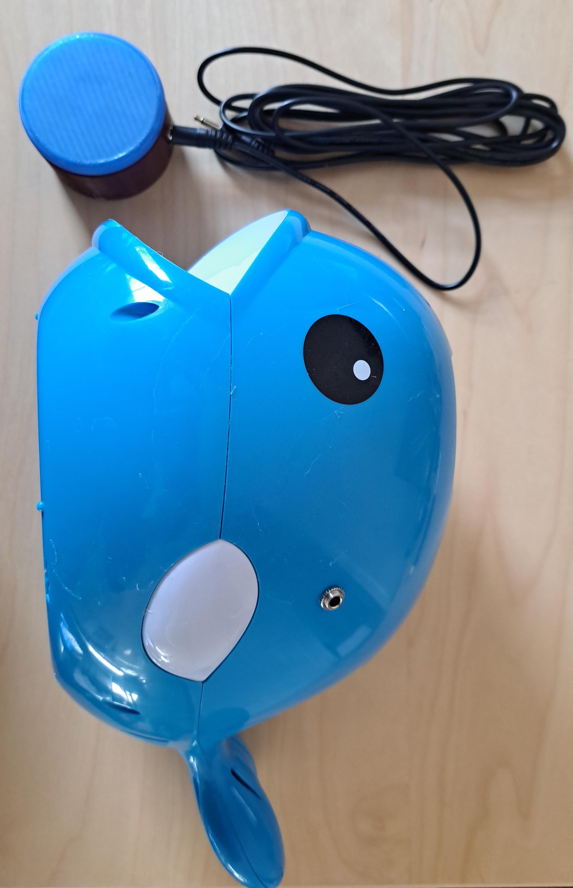

<!--- Open Source Assistive Technology: GitHub Readme Template --->

 <!--- TITLE Should match the name of the GitHub repository. Choose something descriptive rather than whimsical.  --->
# Switch Adapted Whale Bubble Blower

<!--- SUMMARY A brief summary of the project. What it does, who it is for, how much it costs.  --->
The Switch Adapted Whale Bubble Blower is an adapted “Balnore Bubble Machine” that can be activated with a 3.5mm switch. This adaptation is intended for users who have difficulty activating the button on the side of the bubble machine.

<!--- PHOTO --->

## More info at
 - [Makers Making Change Project Page]([https://makersmakingchange.com/project/switch-adapted-whale-bubble-blower/](https://www.makersmakingchange.com/s/product/whale-bubble-blower/01tJR0000008XObYAM))

## Getting Started
<!--- Include an overall idea of what major steps are required to build the device. --->

### 1. Order the Off-The-Shelf Components
The [Bill of Materials](/Documentation/WhaleBubbleBlower_BOM_v0.1.xlsx) lists all of the parts and components required to build the Switch Adapted Whale Bubble Blower. The electronic components may be available locally, but will probably need to be ordered online. 

### 2. Assemble the Switch Adapted Whale Bubble Blower
Reference the [maker guide](/Documentation/WhaleBubbleBlower_Maker_Guide_v1.0.pdf) for the tools and steps required to build each portion.

## Files
<!---FILES  This section includes all the information and files required to build and modify the device, including documentation, design files, and build files. --->

### Documentation
<!--- DOCUMENTATION --->
| Document | Version | Link |
|----------|---------|------|
| Design Rationale     | 1.0 | [WhaleBubbleBlower_Design_Rationale](/Documentation/WhaleBubbleBlower_Design_Rationale_v0.1.pdf) |
| Bill of Materials    | 1.0 | [WhaleBubbleBlower_BOM](/Documentation/WhaleBubbleBlower_BOM_v0.1.xlsx) |
| Maker Guide       | 1.0 | [WhaleBubbleBlower_Maker_Guide](/Documentation/WhaleBubbleBlower_Maker_Guide_v0.1.pdf) |
| User Guide          | 1.0 | [WhaleBubbleBlower_User_Guide](/Documentation/WhaleBubbleBlower_User_Guide_v0.1.pdf)           |
| Changelog            | 1.0 | [WhaleBubbleBlower_Changelog](/Documentation/WhaleBubbleBlower_Changelog_v0.1.pdf)               |

## License
<!--- LICENSE  Choose an appropriate license. We recommend an open-source hardware compatible license. --->
Everything needed or used to design, make, test, or prepare the Switch Adapted Whale Bubble Blower is licensed under the CERN 2.0 Permissive license <https://ohwr.org/project/cernohl/wikis/Documents/CERN-OHL-version-2> (CERN-OHL-P).

Accompanying material such as instruction manuals, videos, and other copyrightable works that are useful but not necessary to design, make, test, or prepare the Switch Adapted Whale Bubble Blower are published under a Creative Commons Attribution-ShareAlike 4.0 license <https://creativecommons.org/licenses/by-sa/4.0/> (CC BY-SA 4.0).

## Attribution
<!--- ATTRIBUTION Include any information related to the development of the design. This may include who identified the initial challenge, who contributed to the design --->
 - The documentation template was created by Makers Making Change and is used under a CC BY-SA 4.0 license. It is available at the following link: https://github.com/makersmakingchange/OpenAT-Template

<!-- ABOUT MMC START -->
## About Makers Making Change

Makers Making Change is a program of [Neil Squire](https://www.neilsquire.ca/), a Canadian non-profit that uses technology, knowledge, and passion to empower people with disabilities.

Makers Making Change leverages the capacity of community based Makers, Disability Professionals and Volunteers to develop and deliver affordable Open Source Assistive Technologies.

 - Website: [www.MakersMakingChange.com](https://www.makersmakingchange.com/)
 - GitHub: [makersmakingchange](https://github.com/makersmakingchange)
 - Bluesky: [@makersmakingchange.bsky.social](https://bsky.app/profile/makersmakingchange.bsky.social)
 - Instagram: [@makersmakingchange](https://www.instagram.com/makersmakingchange)
 - Facebook: [makersmakechange](https://www.facebook.com/makersmakechange)
 - LinkedIn: [Neil Squire Society](https://www.linkedin.com/company/neil-squire-society/)
 - Thingiverse: [makersmakingchange](https://www.thingiverse.com/makersmakingchange/about)
 - Printables: [MakersMakingChange](https://www.printables.com/@MakersMakingChange)

### Contact Us
For technical questions, to get involved, or to share your experience we encourage you to [visit our website](https://www.makersmakingchange.com/) or [contact us](https://www.makersmakingchange.com/s/contact).
<!-- ABOUT MMC END -->
